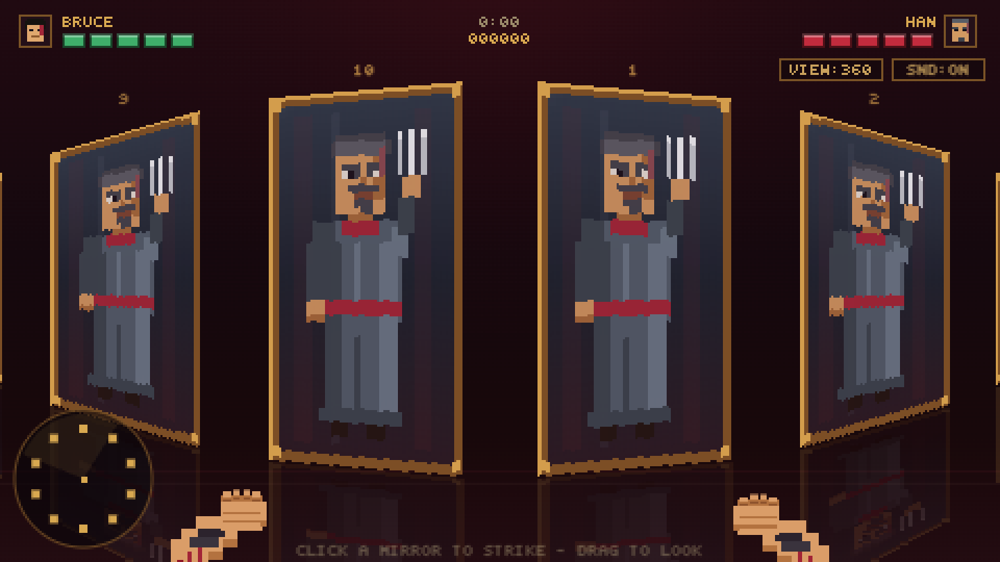

# Hall of Mirrors — Bruce vs Han

A playable pixel-art homage to the final mirror-room duel of *Enter the Dragon*:
https://www.youtube.com/watch?v=mCdbIDiib5U

Han hides behind one of ten mirrors that ring the room — every intact pane shows his
reflection, but only one is real. Read the cracks, find him, break the illusion.

<p>
  <a href="https://majedgitsgood.github.io/bruce-lee-hall-of-mirrors/"></a>
</p>




## ▶ Play

**[Play it live in your browser →](https://majedgitsgood.github.io/bruce-lee-hall-of-mirrors/)**
No install, no plugins — it runs anywhere with a modern browser.

## The idea

This started as a design doc, not code. The full concept and the trimmed v1 scope that actually
shipped both live in **[SPEC.md](SPEC.md)** — you can trace nearly every mechanic below back to a
line there. Release history is in **[CHANGELOG.md](CHANGELOG.md)**.

## How to play

- **Click a mirror** (or press **0–9**) to strike it.
- **Hit** — Han takes damage, the glass explodes, and he relocates to a random intact mirror.
  Consecutive hits build a **combo multiplier**.
- **Miss** — you take damage and the pane shatters, leaving a **red number that tells you Han's
  distance** around the ring: 1 = an adjacent mirror, up to 5 = directly opposite.
- Broken mirrors can't hide Han. The ring minimap (bottom-left) tracks every clue. Five misses and
  you're done; five hits and Han falls.
- Score = strikes × combo, plus a time bonus for finishing fast.

## Controls

| Input | Action |
| --- | --- |
| Click / tap | Strike a mirror, start game |
| Drag or ← → | Look around the ring (360° view) |
| 0–9 | Strike mirror by number |
| ↑ | Strike the mirror centered in view |
| M | Mute |
| Enter / Space | Start / restart |

An in-game **Tutorial** button (top right) opens a how-to-play overlay.

## Run it locally

Everything is vanilla HTML/CSS/JS — no build, no dependencies, no assets on disk (all art and audio
are generated in code). Any static server works:

```sh
python3 serve.py          # dev server with no-cache headers, port 8642
# or
python3 -m http.server 8642
```

Then open <http://localhost:8642>.

## Tech notes

- 480×270 canvas upscaled with `image-rendering: pixelated`; CRT scanline + vignette overlays.
- One pane-projection renderer for the rotating 360° camera (column-strip blitting fakes the
  perspective skew).
- All sprites are drawn procedurally at load ([js/sprites.js](js/sprites.js)); all sound is
  synthesized WebAudio ([js/audio.js](js/audio.js)).
- Set `window.DEBUG = true` in the console to log Han's position.

## Roadmap

Bigger ideas from the [master spec](SPEC.md), not yet built: progressive body damage, spinning
spear intro / impaled exit animations with movie-quote audio, a difficulty slider, and
leaderboards. See the [changelog](CHANGELOG.md#unreleased--roadmap) for the full list.

## Credits & homage

An unofficial fan tribute to the mirror-room finale of *Enter the Dragon* (1973). The film,
its characters, and all related trademarks belong to their respective owners; this project claims
no affiliation. The **code** in this repository is released under the [MIT License](LICENSE).

Built by Majed Assa.
